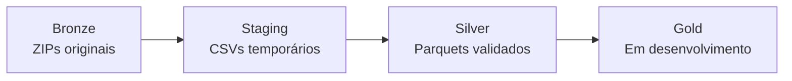

# Pipeline dos Microdados do ENEM — 1998 a 2025

Pipeline de dados para organizar, selecionar, transformar e armazenar os Microdados do Exame Nacional do Ensino Médio (ENEM) entre 1998 e 2025.

O projeto utiliza uma arquitetura inspirada no padrão Medalhão. Os arquivos originais são preservados na camada Bronze, os CSVs são extraídos temporariamente para o Staging e os registros selecionados são gravados em formato Parquet na camada Silver.

O recorte atualmente implementado considera o estado do Pará (`PA`). A estrutura permite utilizar outra Unidade da Federação por meio dos parâmetros do pipeline.

## Objetivos

- organizar os microdados anuais do ENEM em uma estrutura reproduzível;
- preservar os arquivos originais sem modificações;
- selecionar somente as variáveis definidas no catálogo do projeto;
- excluir questionários e arquivos auxiliares, como `ITENS_PROVA`;
- filtrar os registros por Unidade da Federação;
- harmonizar os tipos das variáveis entre as edições;
- armazenar os resultados em Parquet para facilitar consultas e análises;
- validar duplicações, ano, UF, identificadores e integridade dos arquivos;
- preparar os dados para a futura camada Gold.

## Arquitetura



### Bronze

Contém os 28 arquivos ZIP originais, correspondentes às edições de 1998 a 2025. Esses arquivos não são alterados ou removidos pelo pipeline.

### Staging

Área temporária utilizada para extrair apenas os CSVs necessários ao processamento. Os arquivos são removidos somente depois que a Silver correspondente existe e foi validada.

### Silver

Contém os dados selecionados, filtrados para a UF desejada, tipados e armazenados em Parquet.

### Gold

Camada analítica destinada a indicadores, agregações históricas e conjuntos comparáveis entre os anos. Esta etapa está em desenvolvimento.

## Estrutura do projeto

```text
ENEM/
├── data/
│   ├── bronze/
│   │   ├── microdados_enem_1998.zip
│   │   ├── ...
│   │   └── microdados_enem_2025.zip
│   ├── staging/
│   │   └── ano_AAAA/
│   ├── silver/
│   │   ├── microdados_selecionados/
│   │   ├── participantes/
│   │   └── resultados/
│   ├── gold/
│   └── metadata/
│       └── dicionarios/
│           └── variaveis_enem_por_ano.csv
├── notebook/
│   ├── 00_download_data_ENEM.ipynb
│   ├── 01_inspecao_bronze.ipynb
│   ├── 02_mapeamento_arquivos.ipynb
│   ├── 03_extracao_staging.ipynb
│   ├── 04_leitura_duckdb.ipynb
│   ├── 05_validacao_modulos.ipynb
│   └── 06_pipeline_bronze_silver.ipynb
├── src/
│   └── enem_pipeline/
│       ├── __init__.py
│       ├── auditoria.py
│       ├── catalogo.py
│       ├── config.py
│       ├── extracao.py
│       ├── gravacao.py
│       ├── leitura.py
│       ├── limpeza.py
│       ├── processamento.py
│       ├── processamento_separado.py
│       └── transformacao.py
└── README.md
```


## Tecnologias principais

- Python 3.9;
- DuckDB 1.4.5;
- pandas;
- Jupyter Notebook;
- Parquet;
- `pathlib` e módulos da biblioteca padrão do Python.

O DuckDB permite consultar e transformar arquivos grandes sem carregar todo o conjunto de dados simultaneamente em um DataFrame pandas.

## Catálogo de variáveis

O arquivo `variaveis_enem_por_ano.csv` define as variáveis selecionadas em cada edição:

- 28 colunas, correspondentes aos anos de 1998 a 2025;
- 54 posições disponíveis para variáveis;
- entre 25 e 52 variáveis selecionadas por edição;
- catálogo auditado contra os cabeçalhos dos arquivos originais.

O catálogo é necessário porque os nomes, a quantidade e a disponibilidade das variáveis mudam ao longo da série histórica.

## Layout dos microdados

### Edições de 1998 a 2023

Essas edições possuem um arquivo principal de microdados. O resultado é um Parquet por ano:

```text
data/silver/microdados_selecionados/
└── ano=AAAA/
    └── uf=PA/
        └── enem_PA_AAAA.parquet
```

### Edições de 2024 e 2025

A partir de 2024, os dados foram distribuídos em duas bases principais:

- `PARTICIPANTES_AAAA.csv`, identificado por `NU_INSCRICAO`;
- `RESULTADOS_AAAA.csv`, identificado por `NU_SEQUENCIAL`.

Esses identificadores são distintos. Portanto, não existe uma chave individual comum que permita relacionar as duas bases linha a linha.

Por essa razão, participantes e resultados são processados e armazenados separadamente:

```text
data/silver/participantes/
└── ano=AAAA/uf=PA/participantes_PA_AAAA.parquet

data/silver/resultados/
└── ano=AAAA/uf=PA/resultados_PA_AAAA.parquet
```

As cinco variáveis compartilhadas entre as bases são:

```text
NU_ANO
CO_MUNICIPIO_PROVA
NO_MUNICIPIO_PROVA
CO_UF_PROVA
SG_UF_PROVA
```

A correspondência entre participantes e resultados foi validada apenas de forma agregada por município, sem assumir correspondência individual.

## Módulos do pipeline

| Módulo | Responsabilidade |
|---|---|
| `config.py` | Diretórios, período, UF padrão, separadores e codificações |
| `catalogo.py` | Carregamento e consulta das variáveis selecionadas por ano |
| `extracao.py` | Localização dos ZIPs, classificação e extração dos CSVs principais |
| `leitura.py` | Criação de conexões e views DuckDB sobre os CSVs |
| `transformacao.py` | Seleção, limpeza, filtragem geográfica e conversão de tipos |
| `gravacao.py` | Construção dos destinos e gravação segura dos Parquets |
| `auditoria.py` | Comparação do catálogo com os cabeçalhos das edições |
| `processamento.py` | Orquestração do processamento anual e em lotes |
| `processamento_separado.py` | Processamento independente de participantes e resultados em 2024–2025 |
| `limpeza.py` | Remoção segura dos CSVs temporários do Staging |

## Regras de transformação

As principais regras de tipagem são:

- identificadores e códigos geográficos permanecem como `VARCHAR`;
- notas e percentuais são convertidos para `DOUBLE`;
- variáveis categóricas numéricas são convertidas para `SMALLINT`;
- valores vazios são normalizados como nulos;
- o recorte territorial utiliza a variável de UF disponível em cada período.

Também foram configuradas codificações específicas para os arquivos que não utilizam UTF-8. As edições de 2006, 2008 e de 2011 a 2025 são lidas como `latin-1`.

## Validações

O pipeline verifica:

- existência dos ZIPs;
- reconhecimento do layout anual;
- presença das variáveis previstas no catálogo;
- quantidade de registros;
- duplicações no identificador da base;
- identificadores nulos;
- registros pertencentes a outras UFs;
- valores ausentes ou incorretos em `NU_ANO`;
- tamanho e existência do Parquet gravado;
- correspondência municipal entre participantes e resultados em 2024–2025.

## Notebooks

### `05_teste_modulos.ipynb`

Notebook original utilizado durante o desenvolvimento. Foi preservado como histórico das investigações, testes e correções intermediárias.

### `05_validacao_modulos.ipynb`

Versão reorganizada e objetiva dos testes dos módulos. Valida configuração, catálogo, inventário, layouts, tipagem, destinos e integração.

### `06_pipeline_bronze_silver.ipynb`

Notebook operacional responsável pelo processamento em lotes, limpeza do Staging, auditoria final e geração do manifesto da Silver.

## Execução

### 1. Preparar o ambiente

Exemplo com Conda:

```bash
conda create -n enem_pipeline python=3.9
conda activate enem_pipeline
pip install duckdb==1.4.5 pandas jupyter
```

### 2. Organizar os dados

Coloque os ZIPs na camada Bronze seguindo o padrão:

```text
data/bronze/microdados_enem_AAAA.zip
```

Coloque o catálogo em:

```text
data/metadata/dicionarios/variaveis_enem_por_ano.csv
```

### 3. Validar os módulos

Abra e execute:

```text
notebook/05_validacao_modulos.ipynb
```

### 4. Executar o pipeline

No notebook `06_pipeline_bronze_silver.ipynb`, revise os parâmetros:

```python
UF_PROCESSAMENTO = "PA"

EXECUTAR_PIPELINE = True
LIMPAR_STAGING_APOS_SUCESSO = True
CONTINUAR_EM_ERRO = False
```

Em uma nova execução, o pipeline pode reutilizar e validar arquivos Silver já existentes.

## Resultados alcançados

O processamento Bronze → Silver foi concluído para todas as edições previstas.

| Indicador | Resultado |
|---|---:|
| Edições processadas | 28 |
| Parquets do layout único, 1998–2023 | 26 |
| Parquets de participantes, 2024–2025 | 2 |
| Parquets de resultados, 2024–2025 | 2 |
| Total esperado na Silver | 30 |
| Registros do layout único, 1998–2023 | 4.766.831 |
| Participantes, 2024–2025 | 537.389 |
| Resultados, 2024–2025 | 537.389 |
| Espaço liberado no Staging | aproximadamente 57,96 GiB |
| Erros de processamento registrados | 0 |
| Erros de limpeza registrados | 0 |

Para 2024 foram selecionados 248.061 registros em cada base. Para 2025 foram selecionados 289.328 registros em cada base.

## Estado atual do projeto

| Componente | Situação |
|---|---|
| Inventário dos 28 ZIPs | Concluído |
| Catálogo de variáveis por ano | Concluído e auditado |
| Extração seletiva dos CSVs | Concluída |
| Processamento do layout único | Concluído para 1998–2023 |
| Processamento separado | Concluído para 2024–2025 |
| Gravação dos 30 Parquets | Concluída |
| Limpeza segura do Staging | Executada durante os lotes |
| Auditoria consolidada da Silver | Próxima etapa |
| Manifesto da Silver | Em desenvolvimento |
| Testes automatizados | Em desenvolvimento |
| Camada Gold | Em desenvolvimento |
| Indicadores e análises históricas | Planejados |

## Próximas etapas — em desenvolvimento

1. Executar a auditoria final reutilizando os 30 Parquets existentes.
2. Confirmar as 28 edições e verificar que não restaram CSVs no Staging.
3. Gerar `data/metadata/manifesto_silver_PA.csv`, com uma linha por Parquet.
4. Converter as principais validações dos notebooks em testes automatizados.
5. Consolidar as dependências em um arquivo `requirements.txt` ou arquivo equivalente do ambiente.
6. Documentar a execução por linha de comando.
7. Modelar a camada Gold com variáveis comparáveis ao longo do tempo.
8. Criar indicadores agregados por ano, município e UF.
9. Manter participantes e resultados de 2024–2025 separados nas análises individuais.

## Observações

- Os arquivos auxiliares e questionários não fazem parte da Silver.
- Os dados originais devem permanecer preservados na Bronze.
- A limpeza automática atua somente sobre os arquivos principais do Staging.
- O pipeline não deve relacionar `NU_INSCRICAO` e `NU_SEQUENCIAL` como se fossem a mesma chave.
- Os dados do ENEM pertencem ao Instituto Nacional de Estudos e Pesquisas Educacionais Anísio Teixeira (Inep).

