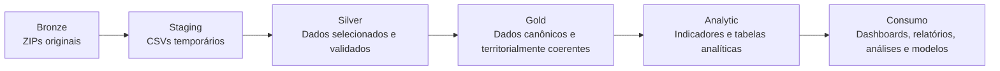

# Pipeline dos Microdados do ENEM — 1998 a 2025

Pipeline de dados para organizar, selecionar, transformar e armazenar os Microdados do Exame Nacional do Ensino Médio (ENEM) entre 1998 e 2025.

O projeto utiliza uma arquitetura inspirada no padrão Medalhão. Os arquivos originais são preservados na camada Bronze, os CSVs são extraídos temporariamente para o Staging e os registros selecionados são gravados em formato Parquet na camada Silver.

O recorte atualmente implementado considera o estado do Pará (`PA`). A estrutura permite utilizar outra Unidade da Federação por meio dos parâmetros do pipeline.

## Objetivos

* organizar os microdados anuais do ENEM em uma estrutura reproduzível;
* preservar os arquivos originais sem modificações;
* selecionar somente as variáveis definidas no catálogo do projeto;
* excluir questionários e arquivos auxiliares, como `ITENS_PROVA`;
* filtrar os registros por Unidade da Federação;
* harmonizar os tipos das variáveis entre as edições;
* armazenar os resultados em Parquet para facilitar consultas e análises;
* validar duplicações, ano, UF, identificadores e integridade dos arquivos;
* construir uma camada Gold territorialmente coerente e historicamente rastreável;
* construir uma camada Analítica com indicadores agregados por município e ano;
* preservar explicitamente as diferenças históricas de disponibilidade das variáveis;
* preparar os dados para análises estatísticas, espaciais, séries temporais, dashboards e modelos de aprendizado de máquina.

## Arquitetura



### Bronze

Contém os 28 arquivos ZIP originais, correspondentes às edições de 1998 a 2025. Esses arquivos não são alterados ou removidos pelo pipeline.

### Staging

Área temporária utilizada para extrair os CSVs necessários ao processamento. Os arquivos são removidos somente depois que a Silver correspondente existe e foi validada.

### Silver

Contém os dados selecionados, filtrados para a UF desejada, tipados e armazenados em Parquet.

A Silver preserva a estrutura das fontes processadas e mantém separadas as bases `PARTICIPANTES` e `RESULTADOS` de 2024 e 2025.

### Gold

A Gold é a camada de dados canônicos e historicamente harmonizados do projeto.

Ela mantém os registros em nível físico, mas estabelece um contrato comum de variáveis e uma referência territorial explícita para cada período.

A referência territorial utilizada é:

* 1998–2000: município de residência;
* 2001–2007: município da escola;
* 2008–2025: município da prova.

As edições de 2024 e 2025 permanecem com `PARTICIPANTES` e `RESULTADOS` como fontes distintas. Não é realizado relacionamento individual entre essas bases. A integração ocorre no nível municipal.

A Gold é destinada à consolidação e disponibilização de dados coerentes para a camada Analítica. Ela não representa ainda os indicadores finais de análise.

### Analytic

A camada Analítica transforma os dados Gold em produtos agregados destinados ao consumo analítico.

A granularidade principal é município × ano, com exceção dos produtos cuja unidade exige uma dimensão adicional, como a distribuição por faixa etária.

Atualmente são produzidos:

* perfil demográfico;
* distribuição por faixa etária;
* presença e ausência;
* desempenho em redação;
* desempenho objetivo de 1998–2008;
* desempenho por áreas de 2009–2025;
* perfil por dependência administrativa da escola.

A camada Analítica preserva as diferenças históricas de disponibilidade das variáveis. Ausência de informação não é convertida automaticamente em zero.

## Estrutura do projeto

```text
```text
ENEM/
├── data/
│   ├── bronze/
│   │   └── microdados_enem_AAAA.zip
│   ├── staging/
│   │   └── ano_AAAA/
│   ├── silver/
│   │   ├── microdados_selecionados/
│   │   ├── participantes/
│   │   └── resultados/
│   ├── gold/
│   │   └── uf=PA/
│   │       ├── ano=AAAA/
│   │       │   └── base=YYYY/
│   │       │       └── dados.parquet
│   │       └── ...
│   ├── analytic/
│   │   └── uf=PA/
│   │       ├── demografia_municipal.parquet
│   │       ├── faixa_etaria_municipal.parquet
│   │       ├── presenca_municipal.parquet
│   │       ├── desempenho_redacao_municipal.parquet
│   │       ├── desempenho_objetiva_municipal.parquet
│   │       ├── desempenho_areas_municipal.parquet
│   │       └── escola_municipal.parquet
│   └── metadata/
│       ├── dicionarios/
│       │   └── variaveis_enem_por_ano.csv
│       ├── manifesto_silver_PA.csv
│       ├── manifesto_gold_PA.csv
│       └── manifesto_analytic_PA.csv
├── notebook/
│   ├── 00_download_data_ENEM.ipynb
│   ├── 01_inspecao_bronze.ipynb
│   ├── 02_mapeamento_arquivos_bronze.ipynb
│   ├── 03_extracao_staging.ipynb
│   ├── 04_leitura_duckdb.ipynb
│   ├── 04_geracao_catalogo_variaveis.ipynb
│   ├── 05_validacao_modulos.ipynb
│   ├── 06_pipeline_bronze_silver.ipynb
│   ├── 07_auditoria_camada_silver.ipynb
│   ├── 08_modelagem_gold_municipio_ano.ipynb
│   ├── 09_auditoria_gold.ipynb
│   └── 10_analitico.ipynb
├── src/
│   └── enem_pipeline/
│       ├── __init__.py
│       ├── auditoria.py
│       ├── catalogo.py
│       ├── cli.py
│       ├── config.py
│       ├── extracao.py
│       ├── geracao_catalogo.py
│       ├── gravacao.py
│       ├── leitura.py
│       ├── limpeza.py
│       ├── processamento.py
│       ├── processamento_separado.py
│       └── transformacao.py
├── src/
│   └── testes/
└── README.md
```


## Tecnologias principais

- Python 3.9;
- DuckDB 1.4.5;
- pandas;
- Jupyter Notebook;
- Parquet;
- `pathlib` e módulos da biblioteca padrão do Python.

O DuckDB permite consultar e transformar arquivos grandes sem carregar todo o conjunto de dados simultaneamente em um DataFrame pandas.

## Catálogo de variáveis

O arquivo `variaveis_enem_por_ano.csv` define as variáveis selecionadas em cada edição:

- 28 colunas, correspondentes aos anos de 1998 a 2025;
- 54 posições disponíveis para variáveis;
- entre 25 e 52 variáveis selecionadas por edição;
- catálogo auditado contra os cabeçalhos dos arquivos originais.

O catálogo é necessário porque os nomes, a quantidade e a disponibilidade das variáveis mudam ao longo da série histórica.

## Layout dos microdados

### Edições de 1998 a 2023

Essas edições possuem um arquivo principal de microdados. O resultado é um Parquet por ano:

```text
data/silver/microdados_selecionados/
└── ano=AAAA/
    └── uf=PA/
        └── enem_PA_AAAA.parquet
```

### Edições de 2024 e 2025

A partir de 2024, os dados foram distribuídos em duas bases principais:

- `PARTICIPANTES_AAAA.csv`, identificado por `NU_INSCRICAO`;
- `RESULTADOS_AAAA.csv`, identificado por `NU_SEQUENCIAL`.

Esses identificadores são distintos. Portanto, não existe uma chave individual comum que permita relacionar as duas bases linha a linha.

Por essa razão, participantes e resultados são processados e armazenados separadamente:

```text
data/silver/participantes/
└── ano=AAAA/uf=PA/participantes_PA_AAAA.parquet

data/silver/resultados/
└── ano=AAAA/uf=PA/resultados_PA_AAAA.parquet
```

As cinco variáveis compartilhadas entre as bases são:

```text
NU_ANO
CO_MUNICIPIO_PROVA
NO_MUNICIPIO_PROVA
CO_UF_PROVA
SG_UF_PROVA
```

A correspondência entre participantes e resultados foi validada apenas de forma agregada por município, sem assumir correspondência individual.

## Módulos do pipeline

| Módulo | Responsabilidade |
|---|---|
| `config.py` | Diretórios, período, UF padrão, separadores e codificações |
| `catalogo.py` | Carregamento e consulta das variáveis selecionadas por ano |
| `extracao.py` | Localização dos ZIPs, classificação e extração dos CSVs principais |
| `leitura.py` | Criação de conexões e views DuckDB sobre os CSVs |
| `transformacao.py` | Seleção, limpeza, filtragem geográfica e conversão de tipos |
| `gravacao.py` | Construção dos destinos e gravação segura dos Parquets |
| `auditoria.py` | Comparação do catálogo com os cabeçalhos das edições |
| `processamento.py` | Orquestração do processamento anual e em lotes |
| `processamento_separado.py` | Processamento independente de participantes e resultados em 2024–2025 |
| `limpeza.py` | Remoção segura dos CSVs temporários do Staging |

## Regras de transformação

As principais regras de tipagem são:

- identificadores e códigos geográficos permanecem como `VARCHAR`;
- notas e percentuais são convertidos para `DOUBLE`;
- variáveis categóricas numéricas são convertidas para `SMALLINT`;
- valores vazios são normalizados como nulos;
- o recorte territorial utiliza a variável de UF disponível em cada período.

Também foram configuradas codificações específicas para os arquivos que não utilizam UTF-8. As edições de 2006, 2008 e de 2011 a 2025 são lidas como `latin-1`.

## Validações

A arquitetura atual possui validações específicas para cada camada.

### Silver

São verificadas a existência dos arquivos, cobertura das edições, catálogo de variáveis, identificadores, duplicações, UF, ano, tamanho e integridade dos Parquets.

### Gold

A auditoria da Gold verifica:

* integridade do manifesto;
* existência dos 30 arquivos Gold;
* cobertura das 28 edições;
* schema canônico de 29 colunas;
* cardinalidade Silver → Gold;
* referência territorial por período;
* integridade territorial dos registros;
* compatibilidade municipal entre `PARTICIPANTES` e `RESULTADOS` em 2024–2025;
* perfil histórico de preenchimento das variáveis.

### Analytic

A auditoria da camada Analítica verifica:

* existência dos 7 produtos;
* correspondência entre manifesto e arquivos físicos;
* número de linhas e colunas;
* período efetivamente representado;
* granularidade;
* unicidade das chaves analíticas;
* consistência básica dos indicadores e percentuais.

O pipeline verifica:

- existência dos ZIPs;
- reconhecimento do layout anual;
- presença das variáveis previstas no catálogo;
- quantidade de registros;
- duplicações no identificador da base;
- identificadores nulos;
- registros pertencentes a outras UFs;
- valores ausentes ou incorretos em `NU_ANO`;
- tamanho e existência do Parquet gravado;
- correspondência municipal entre participantes e resultados em 2024–2025.

## Notebooks

### `05_teste_modulos.ipynb`

Notebook original utilizado durante o desenvolvimento. Foi preservado como histórico das investigações, testes e correções intermediárias.

### `05_validacao_modulos.ipynb`

Versão reorganizada e objetiva dos testes dos módulos. Valida configuração, catálogo, inventário, layouts, tipagem, destinos e integração.

### `06_pipeline_bronze_silver.ipynb`

Notebook operacional responsável pelo processamento em lotes, limpeza do Staging, auditoria final e geração do manifesto da Silver.

### `07_auditoria_camada_silver.ipynb`

Auditoria consolidada da camada Silver.

### `08_modelagem_gold_municipio_ano.ipynb`

Constrói a camada Gold a partir dos Parquets Silver.  Define o 
contrato canônico de variáveis, a referência territorial histórica e a estrutura física da Gold. As fontes de 2024 e 2025 permanecem separadas entre `PARTICIPANTES` e `RESULTADOS`.

### `09_auditoria_gold.ipynb`

Realiza a auditoria independente da camada Gold, verificando schema, cardinalidade, território,
compatibilidade municipal e preenchimento histórico.

### `10_analitico.ipynb`

Constrói os produtos da camada Analítica a partir da Gold, grava os Parquets analíticos, gera 
o manifesto da camada e executa as auditorias estrutural, temporal, de granularidade e de conteúdo.

## Execução

### 1. Preparar o ambiente

Exemplo com Conda:

```bash
conda create -n enem_pipeline python=3.9
conda activate enem_pipeline
pip install duckdb==1.4.5 pandas jupyter
```

### 2. Organizar os dados

Coloque os ZIPs na camada Bronze seguindo o padrão:

```text
data/bronze/microdados_enem_AAAA.zip
```

Coloque o catálogo em:

```text
data/metadata/dicionarios/variaveis_enem_por_ano.csv
```

### 3. Validar os módulos

Abra e execute:

```text
notebook/05_validacao_modulos.ipynb
```

### 4. Executar o pipeline

No notebook `06_pipeline_bronze_silver.ipynb`, revise os parâmetros:

```python
UF_PROCESSAMENTO = "PA"

EXECUTAR_PIPELINE = True
LIMPAR_STAGING_APOS_SUCESSO = True
CONTINUAR_EM_ERRO = False
```

Em uma nova execução, o pipeline pode reutilizar e validar arquivos Silver já existentes.

## Resultados alcançados
O processamento Bronze → Silver foi concluído para todas as edições previstas.

A camada Silver possui 30 fontes para 28 edições, incluindo as bases separadas de `PARTICIPANTES` e `RESULTADOS` de 2024 e 2025.

A camada Gold foi materializada e auditada para as mesmas 30 fontes, preservando a cardinalidade dos registros e estabelecendo um schema canônico de 29 colunas.

A camada Analítica foi materializada com 7 produtos:

| Produto                         | Período   | Granularidade                  |
| ------------------------------- | --------- | ------------------------------ |
| `demografia_municipal`          | 1998–2025 | município × ano                |
| `faixa_etaria_municipal`        | 1998–2025 | município × ano × faixa etária |
| `presenca_municipal`            | 1998–2025 | município × ano                |
| `desempenho_redacao_municipal`  | 1998–2025 | município × ano                |
| `desempenho_objetiva_municipal` | 1998–2008 | município × ano                |
| `desempenho_areas_municipal`    | 2009–2025 | município × ano                |
| `escola_municipal`              | 1998–2025 | município × ano                |

As três camadas Silver, Gold e Analytic possuem manifestos próprios, permitindo rastrear os artefatos físicos produzidos em cada etapa.

## Estado atual do projeto

| Componente                               | Situação                 |
| ---------------------------------------- | ------------------------ |
| Inventário dos 28 ZIPs                   | ✅ Concluído                |
| Catálogo de variáveis por ano            | ✅ Concluído e auditado     |
| Extração seletiva dos CSVs               | ✅ Concluída                |
| Processamento do layout único            | ✅ Concluído para 1998–2023 |
| Processamento separado                   | ✅ Concluído para 2024–2025 |
| Gravação dos 30 Parquets Silver          | ✅ Concluída                |
| Auditoria da Silver                      | ✅ Concluída                |
| Manifesto da Silver                      | ✅ Concluído                |
| Camada Gold                              | ✅ Concluída                |
| Auditoria da Gold                        | ✅ Concluída                |
| Manifesto da Gold                        | ✅ Concluído                |
| Camada Analítica                         | ✅ Concluída                |
| Auditoria da Analytic                    | ✅ Concluída                |
| Manifesto da Analytic                    | ✅ Concluído                |
| Dashboard e produtos de consumo          | Próxima etapa            |
| Modelagem estatística e Machine Learning | Etapa posterior          |


## Próximas etapas — em desenvolvimento

1. Estruturar a camada de consumo a partir dos produtos Analíticos.
2. Criar consultas analíticas reutilizáveis com DuckDB.
3. Desenvolver séries temporais e análises municipais.
4. Desenvolver produtos espaciais e dashboards.
5. Definir conjuntos analíticos específicos para modelagem estatística e Machine Learning.
6. Garantir que modelos respeitem as mudanças históricas de definição e disponibilidade das variáveis.
7. Evoluir a automação das etapas Gold e Analytic para execução reprodutível fora do notebook.

## Observações

- Os arquivos auxiliares e questionários não fazem parte da Silver.
- Os dados originais devem permanecer preservados na Bronze.
- A limpeza automática atua somente sobre os arquivos principais do Staging.
- O pipeline não deve relacionar `NU_INSCRICAO` e `NU_SEQUENCIAL` como se fossem a mesma chave.
- Os dados do ENEM pertencem ao Instituto Nacional de Estudos e Pesquisas Educacionais Anísio Teixeira (Inep).

